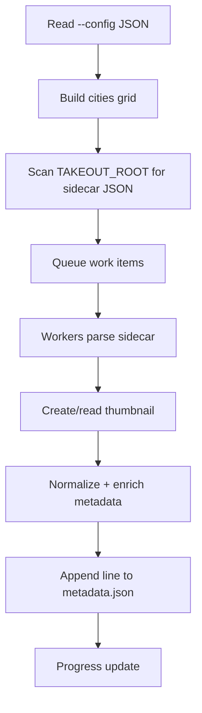

# 🧠🤝 Scripts Guide (Human + AI)

This folder contains the indexing pipeline that turns a Google Takeout-like archive into app-ready metadata + thumbnails.

## 📦 What is in this folder?

- [scripts/indexer.mjs](indexer.mjs): main script entrypoint (scanner + worker pipeline).
- [scripts/indexer/createThumbnailAndPreview.mjs](indexer/createThumbnailAndPreview.mjs): creates thumbnails with Sharp.
- [scripts/indexer/getSizesAndCreatePreview.mjs](indexer/getSizesAndCreatePreview.mjs): reads image dimensions from existing thumbnails.
- [scripts/indexer/ndjsonToJsonMap.mjs](indexer/ndjsonToJsonMap.mjs): converts raw JSON sidecar data to the app shape.
- [scripts/indexer/readJsonSafe.mjs](indexer/readJsonSafe.mjs): safe JSON reader.
- [scripts/indexer/recordProgress.mjs](indexer/recordProgress.mjs): CLI progress line formatter.
- [scripts/indexer/utils.mjs](indexer/utils.mjs): city grid builder used for nearest-city lookup.
- [scripts/indexer/cities.json](indexer/cities.json): city reference dataset.

## 🎯 What the indexer does

The indexer:

1. 📂 Recursively scans TAKEOUT_ROOT for JSON sidecar files.
2. 🧾 Reads each JSON sidecar safely.
3. 🖼️ Finds the original image filename from JSON title, then creates a thumbnail if missing.
4. 📏 Stores width/height from thumbnail metadata.
5. 🌍 Enriches records with nearest city (if GPS is present and cities data is loaded).
6. 💾 Appends normalized records to TARGET_ROOT/metadata.json (newline-delimited JSON objects).
7. ♻️ Resumes safely by skipping already indexed entries from existing metadata output.

## 🚀 How to run

From the project root:

```bash
npm run indexer:hdd
```

This runs:

```bash
node scripts/indexer.mjs --config server-config.json
```

The config is read from [server-config.json](../server-config.json).

## ⚙️ Required config keys

At minimum, set:

- TAKEOUT_ROOT: folder containing albums + Google sidecar JSON files.
- TARGET_ROOT: output cache folder where metadata + thumbnails will be written.

Example:

```json
{
  "TAKEOUT_ROOT": "/mnt/f/Takeout",
  "TARGET_ROOT": "/mnt/f/temp/cache"
}
```

Output generated by the indexer:

- TARGET_ROOT/metadata.json
- TARGET_ROOT/thumbnails/

## 🧱 Output shape

Each written line in metadata.json is one object keyed by computed photo id:

```json
{
  "AlbumName::IMG_1234.JPG": {
    "id": "IMG_1234.JPG",
    "folder": "AlbumName",
    "width": 550,
    "height": 367,
    "latitude": 40.7128,
    "longitude": -74.006,
    "city": { "name": "New York", "country": "US" }
  }
}
```

Notes:

- Key separator is ::.
- The script appends lines (it does not rewrite the whole file each run).

## 🏗️ How it is written

Design choices in [scripts/indexer.mjs](indexer.mjs):

- 🧵 Worker pool via a simple in-memory queue.
- ⚡ Concurrency profile chosen by mode (currently defaulted to SSD profile).
- 🗜️ Sharp cache disabled to reduce memory pressure for long runs.
- 🧺 Buffered writes (batch by count/size) for fewer disk flushes.
- 🔁 Resume support by loading already indexed IDs from output file.

Pipeline overview:



## 🧭 Human guidance (operational)

- ✅ Run from project root so relative paths and config are predictable.
- ✅ Keep TAKEOUT_ROOT read-only if possible.
- ✅ Keep TARGET_ROOT on fast disk (SSD recommended).
- ✅ Re-run indexer anytime; it is designed to resume.
- ✅ Watch terminal progress counters (processed, skipped, failed, img/s, ETA).
- ⚠️ If failed count grows, inspect JSON validity and missing source images.

## 🤖 AI guidance (maintenance + edits)

When changing this pipeline:

- Keep ID format stable: Album::Filename.
- Keep output append-only unless you intentionally migrate format.
- Avoid loading all records into memory; preserve streaming/batched behavior.
- Preserve resume semantics based on existing output IDs.
- If changing concurrency, measure HDD/SSD behavior separately.
- Maintain side-effect boundaries:
  - [scripts/indexer.mjs](indexer.mjs): orchestration.
  - [scripts/indexer/ndjsonToJsonMap.mjs](indexer/ndjsonToJsonMap.mjs): data mapping.
  - [scripts/indexer/createThumbnailAndPreview.mjs](indexer/createThumbnailAndPreview.mjs): image transform only.

Suggested safe refactor order:

1. Add small tests for mapping and ID derivation.
2. Refactor pure transforms first.
3. Refactor IO and concurrency last.
4. Validate with a tiny fixture archive before large runs.

## 🧪 Validation checklist

After any change:

1. Run a tiny sample archive (5-20 files).
2. Verify metadata.json lines parse correctly.
3. Verify thumbnails are created and dimensions match.
4. Re-run the same job and ensure mostly skipped/resumed behavior.
5. Confirm app can load generated metadata.

## 🛠️ Troubleshooting

- ❌ Failed to read config file:
  - Check the --config path and JSON syntax.
- ❌ Failed to read cities.json:
  - Ensure city dataset is accessible. The canonical dataset is [scripts/indexer/cities.json](indexer/cities.json).
- ❌ High failed count:
  - Check for missing image files referenced by JSON title.
  - Check malformed JSON sidecars.
- 🐢 Slow indexing:
  - Use fast storage for TARGET_ROOT.
  - Avoid heavy background disk tasks.

## 🧾 Related project files

- [package.json](../package.json): npm script entrypoints.
- [server-config.json](../server-config.json): runtime config consumed by the indexer.
- [server-utils/script-runner.mjs](../server-utils/script-runner.mjs): server-side script execution and job orchestration.
