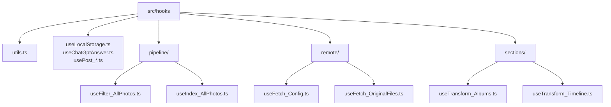

**Hooks Documentation — src/hooks**

📚 Purpose

This document describes the custom React hooks found in the `src/hooks` folder: their overall goal, structure, and governing rules. It is intended for contributors who will add, refactor, or consume hooks in this codebase.

✨ Goals

- Provide a clear mental model for what belongs in `src/hooks`.
- Standardize naming, side-effect handling, and export conventions.
- Explain subfolder responsibilities (`pipeline/`, `remote/`, `sections/`) and file-level intent.
- Offer quick diagrams, examples, and governance rules to keep hooks reusable and testable.

🗂️ Top-level structure

- `useLocalStorage.ts` — localStorage helpers and state-sync hooks
- `useChatGptAnswer.ts` — chatGPT integration wrapper for prompts
- `usePost_*` — POST helpers used to trigger server-side jobs
- `useRelevantAlbumsByProximity.ts` — domain-specific selector hook
- `useTransform_*` — transform helpers (days, thumbnails, exif, nearby places)
- `utils.ts` — shared helper utilities for hooks
- `pipeline/` — composable hook pipelines (filtering, indexing)
- `remote/` — network / fetch hooks and helpers
- `sections/` — hooks that create UI-ready sections (albums, timeline, trips)

Mermaid diagram — folder overview



📌 File-level intent (quick)

- `useLocalStorage.ts` — small, deterministic helpers that mirror state to `localStorage`. Keep them pure where possible; only the persistence side-effect is allowed.
- `useChatGptAnswer.ts` — wrapper around the ChatGPT call flow; should expose loading / error / result and handle cancellation on unmount.
- `useFetch_PostConfig.ts`, `usePost_ScriptsGenerateThumbnails.ts` — trigger server-side operations and return job metadata and progress hooks.
- `useRelevantAlbumsByProximity.ts` — derive album lists from location metadata; pure computation with memoization.
- `useTransform_*` files — convert data shapes (photos → thumbnails, photos → EXIF) and return stable references to avoid rerenders.

📁 `pipeline/`

- Purpose: Compose small reusable hooks into higher-order data pipelines used across the app (filter → index → map).
- Rules: Keep pipeline hooks small, composable, and side-effect-free where possible. If a pipeline needs async work, expose an explicit `start()` or `refresh()` function rather than running automatically on import.

🌐 `remote/`

- Purpose: Encapsulate network calls and remote job interactions (fetching original files, health checks, config). All network hooks must:
  - expose `loading`, `error`, `data` shape
  - accept an abort signal / cancellation token
  - not assume global stores — return data for callers to stash

🧩 `sections/`

- Purpose: Provide UI-oriented data transforms (grouping, paging, section building). These hooks combine transforms and may use pipeline hooks.

Governing rules (must-follow) ✅

- Naming: All hooks must start with `use` and use camelCase e.g. `useTransform_Photos2Thumbnails`.
- One responsibility: Each hook should have a single, testable responsibility.
- Tests: Prefer unit tests for pure transforms and integration tests (mocked fetch) for network hooks.
- Side-effects: Local side-effects (localStorage writes) are allowed in top-level hooks but prefer exposing a controlled API (`save()`, `clear()`), and always clean up on unmount.
- Placement: Put reusable hook logic in `src/hooks`. If logic is only for a specific component tree and very small, consider keeping it local to that component, but prefer extracting to `src/hooks` when shared.
- Do not write code into `src/gallery` — treat it volatile/assets-only. Move code to `src/hooks`/`src/lib` when refactoring.
- MUI styling: where hooks produce style props, prefer returning MUI `sx`-compatible objects instead of raw inline styles.

Conventions & best practices ✨

- Return shape: `{ data, loading, error, refresh? }` is preferred for async hooks.
- Cancellation: Accept an `AbortSignal` or return a cancel function.
- Memoization: Use `useMemo` / `useCallback` for derived values to avoid unnecessary rerenders.
- Determinism: Keep transforms pure; avoid referencing mutable global state inside transform hooks.
- Small helpers: Put small, pure helpers in `utils.ts` for reuse.

Examples

Importing a hook:

```tsx
import useLocalStorage from './useLocalStorage'

function Example(){
  const [value, setValue] = useLocalStorage('key', 'default')
  return null
}
```

Async fetch pattern:

```ts
// preferred shape returned by remote hooks
{
  data: T | null,
  loading: boolean,
  error: Error | null,
  refresh: () => void
}
```

FAQ

- Q: When should I create a new hook under `pipeline/` vs `sections/`?
  - A: If it is a pure data pipeline used by multiple UI pieces, choose `pipeline/`. If it's a UI grouping or section builder, choose `sections/`.

- Q: Can hooks call other hooks in this folder?
  - A: Yes — composition is encouraged (small hooks composed into larger ones). Keep circular imports impossible by keeping file responsibilities orthogonal.

Maintenance checklist for contributors 🛠️

- Add a short description at the top of any new hook file.
- Export named hooks from an index if they are stable public API for other modules.
- Add or update this `HOOKS_DOC.md` when adding new subfolders or changing major conventions.

Next steps you might want me to do

- Generate an `index.ts` that re-exports commonly used hooks.
- Add unit-test skeletons for the pure transform hooks in `useTransform_*`.

— End of document —
