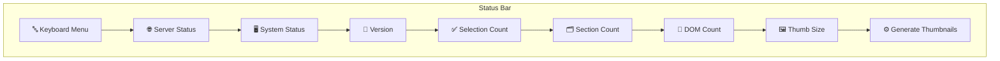

# 🧭 Middleware — `base` Status Items

This folder contains the "base" status items used in the app's status bar. Each item usually has a `*.meta.ts` file (metadata used by the middleware/registry) and a `*.tsx` file (the UI component that renders the status). These components are small, focused, and intended to live in the status area to provide quick, glanceable information and actions.

## What you'll find here

- **Meta files (`*.meta.ts`)**: export registration metadata (id, label, icon, default placement/visibility, priority). The registry reads these to show/hide and order items.
- **Component files (`*.tsx`)**: React components that read application stores/contexts and render the visible UI for the status item. They should be lightweight and performant.

## General pattern and guidance

- Registration: the `*.meta.ts` exports a small object describing the item (id, title, icon, defaultVisible, group/placement). The middleware registry consumes these to mount the item into the status bar.
- Implementation: the `*.tsx` component subscribes to the relevant stores (selection, settings, server state, etc.) and renders a compact UI: icon + short text, tooltip, and optional click action.
- Performance: keep render cost low — prefer simple selectors and memoization. Status items render often and should never block the UI.
- Accessibility: include aria-labels and keyboard interactions when the item is actionable.

## Files in this folder (what they do)

- `KeyboardMenu.meta.ts` / `KeyboardMenu.tsx` 🔤
  - Exposes a compact keyboard shortcuts menu/button. Typically opens a popover showing common keybindings and quick actions.

- `ServerStatus.meta.ts` / `ServerStatus.tsx` 🌐
  - Shows health/connection status of the backend server (online, offline, syncing). May include ping time or a reconnect action.

- `SystemStatus.meta.ts` / `SystemStatus.tsx` 🖥️
  - Reports client/system-level info (e.g., memory pressure, performance warnings, or feature toggles driven by the runtime environment).

- `VersionStatus.meta.ts` / `VersionStatus.tsx` 🧾
  - Displays the running app version and can show available updates or changelog info.

- `ThumbSizeStatus.meta.ts` / `ThumbSizeStatus.tsx` 🖼️
  - Shows/changes the current thumbnail size setting used in galleries and lists. Likely opens a small menu to switch sizes.

- `GenerateThumbnailsStatus.meta.ts` / `GenerateThumbnailsStatus.tsx` ⚙️
  - Indicates background thumbnail generation tasks (queued, running, completed). May show a progress indicator and controls to start/stop.

- `SelectionCountStatus.meta.ts` / `SelectionCountStatus.tsx` ✅
  - Displays number of currently selected photos/items and often provides quick actions (clear selection, act on selection).

- `SectionCountStatus.meta.ts` / `SectionCountStatus.tsx` 🗂️
  - Shows counts related to the current UI section (e.g., number of albums, folders, or search results for the active section).

- `DomCountStatus.meta.ts` / `DomCountStatus.tsx` 🧩
  - Debug/diagnostic metric showing number of DOM nodes or rendered tiles — useful for performance tuning.


## Example: how a status item is structured

1. `*.meta.ts` files export a `ToolMeta`-shaped object — example from this folder:

```ts
import { ToolMeta } from '@/discovery/toolRegistry';

export const meta = {
  id: 'serverStatus',
  tool: [
    { id: 'status-bar', side: 'right', priority: 400 }
  ],
  loader: () => import('@/middleware/base/ServerStatus'),
} as ToolMeta;
```

2. The corresponding `*.tsx` component is a small React component that:
- reads app state (via context/store hooks)
- returns a compact element (usually an icon + short text/number)
- provides a `tooltip` and optional `onClick` behavior

Notes:
- The `tool` array describes where and how the registry should mount the item. Common fields: `id` (e.g. `status-bar`), `side` (`left` or `right`), `priority` (numeric ordering), and an optional `visible` function that receives middleware context.
- `loader` is a lazy import used by the registry to dynamically load the component.

## Mermaid diagram — suggested positions on the status bar

The diagram below shows a suggested left-to-right ordering of the status items (leftmost appears first on the status bar). Adjust ordering via `placement`/priority in the `*.meta.ts` files.



Notes:
- The status bar is configurable — the registry/meta objects control exact ordering. The diagram is a recommended default that groups system/server information to the left and user-count/controls toward the right.
- Items with meta files are intended to be discoverable by whatever middleware/registry scans and mounts them. If you need a new item, follow the `*.meta.ts` + `*.tsx` pattern and register the metadata with the middleware.

## Tips for contributors ✨

- Keep the UI compact — aim for minimal text and a clear icon.
- Use existing stores/hooks in `src/context` to read state rather than creating new global singletons.
- Add storybook/examples when adding complex interactions so reviewers can visualize behavior.
- Document meta fields in the `*.meta.ts` so other developers can tune ordering and visibility easily.

---

If you'd like, I can:

- reorder the Mermaid layout to match the app's actual runtime ordering (I can scan the registry to derive the exact order).
- add per-file examples with links to the `meta` exports in each `*.meta.ts` file.

Enjoy! 🚀
